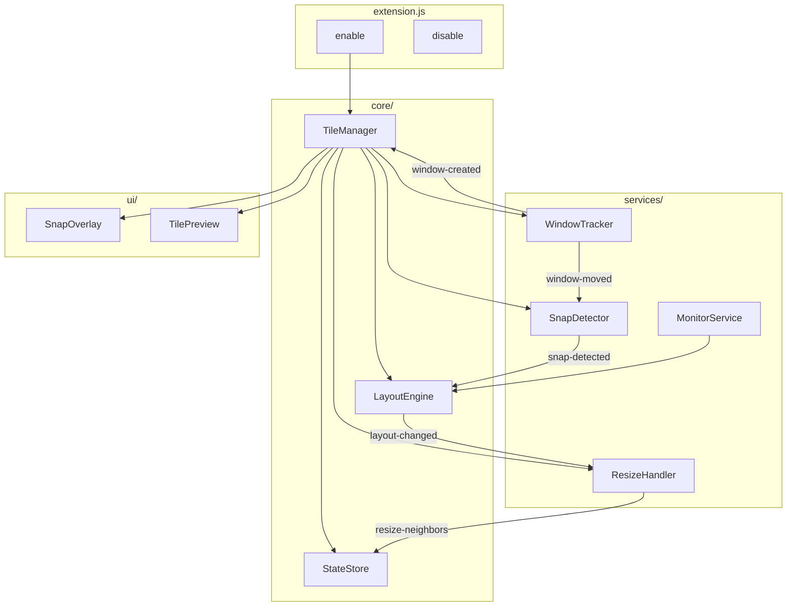

# GNOME Window Manager Extension — Implementation Plan

> **Projektname**: GravTile (Arbeitstitel)  
> **Zielplattform**: Fedora + GNOME 45/46+ + Wayland  
> **Monitor**: Ultrawide 5120x1440 (32:9)

---

## 1. Übersicht & Ziele

### Kernfeatures (Priorität)

| # | Feature | Beschreibung |
|---|---------|--------------|
| 1 | **Edge-Snapping** | Fenster an Bildschirmränder ziehen → 50% links/rechts, 100% oben |
| 2 | **Intelligentes Resize** | Fenster vergrößern → Nachbar schrumpft proportional |
| 3 | **Auto-Tiling** | Neues Fenster öffnen → alle Fenster neu verteilen |
| 4 | **Window-Swapping** | Fenster gegen Rand schieben → tauscht mit Nachbar |
| 5 | **Grouped Tabs** | ⚠️ Nice-to-have, Wayland-Limitierung – Phase 2 |

### Nicht-funktionale Anforderungen

- **Wartbarkeit**: Modulare Architektur, klare Separation of Concerns
- **GNOME-Update-Resistenz**: Abstraktion der GNOME-APIs in eigene Schicht
- **Performance**: Keine spürbaren Lags bei Drag/Resize-Operationen
- **Maus-First**: Primär für Maus-Nutzer optimiert, Shortcuts als Ergänzung
- **Konfigurierbar**: GSettings für wichtige Parameter (Gaps später)

---

## 2. Technologie-Stack

```
┌─────────────────────────────────────────────────────────┐
│                    GNOME Shell (Mutter)                 │
├─────────────────────────────────────────────────────────┤
│  GJS (GNOME JavaScript)                                 │
│  ├── Meta (Window Management)                           │
│  ├── Clutter (Animations, Input)                        │
│  ├── St (Shell Toolkit - UI)                            │
│  └── GLib/Gio (Settings, Signals)                       │
├─────────────────────────────────────────────────────────┤
│  Unsere Extension                                       │
│  ├── Plain JavaScript + JSDoc (kein Build nötig)        │
│  └── ESModules (GNOME 45+ Syntax)                       │
└─────────────────────────────────────────────────────────┘
```

### Warum JavaScript + JSDoc statt TypeScript?
- **Kein Build-Step**: Direktes Testen ohne Kompilierung
- **Schnellerer Dev-Cycle**: Wichtig bei Wayland (Ausloggen/Einloggen)
- **Editor-Support**: JSDoc gibt trotzdem IntelliSense
- **Einfacheres Setup**: Keine @girs Type-Definitions nötig

### Input-Priorität: Maus-First
- **Primär**: Drag & Drop, Edge-Snapping, Resize mit Maus
- **Sekundär**: Keyboard Shortcuts als Bonus (Super+Arrows)

### Wichtige APIs

| API | Verwendung |
|-----|------------|
| `Meta.Window` | Fenster-Objekte, Position, Größe, Zustand |
| `Meta.Display` | Monitor-Informationen, globale Events |
| `Meta.Workspace` | Workspace-Management |
| `global.display` | Singleton für Display-Zugriff |
| `global.workspace_manager` | Workspace-Wechsel |
| `Clutter.Actor` | Für Overlay-Visualisierungen |
| `GLib.timeout_add` | Debouncing, Delays |

---

## 3. Projektstruktur

```
window_manager/
├── gravtile@colin.local/           # Extension-Hauptverzeichnis
│   ├── metadata.json               # Extension-Metadaten
│   ├── extension.js                # Entry Point (enable/disable)
│   ├── prefs.js                    # Settings UI
│   │
│   ├── src/
│   │   ├── core/
│   │   │   ├── TileManager.js      # Orchestrator, Hauptlogik
│   │   │   ├── LayoutEngine.js     # Berechnet Fenster-Layouts
│   │   │   └── StateStore.js       # Zentraler Zustand
│   │   │
│   │   ├── services/
│   │   │   ├── WindowTracker.js    # Fenster-Events (create, destroy, move)
│   │   │   ├── SnapDetector.js     # Edge-Detection beim Drag
│   │   │   ├── ResizeHandler.js    # Intelligentes Resize
│   │   │   └── MonitorService.js   # Multi-Monitor Support
│   │   │
│   │   ├── ui/
│   │   │   ├── SnapOverlay.js      # Visuelle Snap-Zonen
│   │   │   └── TilePreview.js      # Preview beim Drag
│   │   │
│   │   ├── utils/
│   │   │   ├── Geometry.js         # Rect-Berechnungen
│   │   │   ├── Logger.js           # Debug-Logging
│   │   │   └── GnomeCompat.js      # GNOME-Version Abstraction
│   │   │
│   │   └── constants.js            # Konfigurationswerte
│   │
│   └── schemas/
│       └── org.gnome.shell.extensions.gravtile.gschema.xml
│
├── scripts/
│   ├── install.sh                  # Extension installieren
│   ├── reload.sh                   # Extension neu laden
│   └── logs.sh                     # Logs anzeigen
│
├── docs/
│   ├── ARCHITECTURE.md             # Detaillierte Architektur
│   ├── API-REFERENCE.md            # GNOME API Cheatsheet
│   └── DEBUGGING.md                # Debug-Tipps
│
├── plan.md                         # Dieser Plan
└── README.md                       # Projekt-Dokumentation
```

---

## 4. Architektur-Design

### 4.1 Komponenten-Diagramm



### 4.2 State Management

```javascript
// StateStore.js - Zentraler Zustand
{
  windows: Map<windowId, {
    id: number,
    tile: { x: number, y: number, width: number, height: number },
    neighbors: { left: windowId[], right: windowId[], top: windowId[], bottom: windowId[] },
    isManaged: boolean,
    originalGeometry: Rect  // Für Untile
  }>,
  
  layout: {
    columns: number,        // Aktuelle Spalten-Anzahl
    gaps: number,           // Pixel zwischen Fenstern
    outerGaps: number,      // Rand zum Bildschirmrand
  },
  
  monitor: {
    width: 5120,
    height: 1440,
    workArea: Rect          // Ohne Panel/Dock
  }
}
```

### 4.3 Event-Flow

```
┌──────────────┐     ┌──────────────┐     ┌──────────────┐
│ User drags   │     │ SnapDetector │     │ LayoutEngine │
│ window       │ ──▶ │ detects edge │ ──▶ │ calculates   │
└──────────────┘     └──────────────┘     │ new layout   │
                                          └──────┬───────┘
                                                 │
                     ┌──────────────┐            │
                     │ ResizeHandler│ ◀──────────┘
                     │ adjusts      │
                     │ neighbors    │
                     └──────┬───────┘
                            │
                     ┌──────▼───────┐
                     │ StateStore   │
                     │ updates      │
                     └──────┬───────┘
                            │
                     ┌──────▼───────┐
                     │ Windows      │
                     │ move/resize  │
                     └──────────────┘
```

---

## 5. Algorithmen im Detail

### 5.1 Nachbar-Erkennung

```
Problem: Welche Fenster sind "Nachbarn" eines Fensters?

Lösung: Edge-Proximity mit Toleranz

┌─────────┬─────────┐
│    A    │    B    │  A und B sind Nachbarn wenn:
│         │         │  - A.right ≈ B.left (±tolerance)
│         │         │  - Vertikale Überlappung > minOverlap
└─────────┴─────────┘

function findNeighbors(window, direction):
    neighbors = []
    tolerance = 10px
    minOverlap = 50px
    
    for each otherWindow in managedWindows:
        if direction == 'right':
            if abs(window.right - otherWindow.left) < tolerance:
                overlap = calculateVerticalOverlap(window, otherWindow)
                if overlap > minOverlap:
                    neighbors.push(otherWindow)
    
    return neighbors
```

### 5.2 Proportionales Resize

```
Problem: Fenster A wird um Δ breiter, Nachbar B soll schrumpfen

Constraint: A.width + B.width = konstant (ausser bei Gaps)

┌─────────────┬───────────┐
│      A      │     B     │  Vorher: A=60%, B=40%
│   (resize)  │           │
└─────────────┴───────────┘

┌───────────────────┬─────┐
│         A         │  B  │  Nachher: A=80%, B=20%
│                   │     │
└───────────────────┴─────┘

function handleResize(window, newRect):
    oldRect = stateStore.get(window.id).tile
    delta = newRect.width - oldRect.width
    
    neighbors = findNeighbors(window, 'right')
    
    for neighbor in neighbors:
        neighborRect = stateStore.get(neighbor.id).tile
        
        // Schrumpfe Nachbar um anteiligen Delta
        shrinkAmount = delta * (neighborRect.width / totalNeighborWidth)
        
        // Respektiere min-width
        newNeighborWidth = max(neighborRect.width - shrinkAmount, MIN_WIDTH)
        
        applyResize(neighbor, newNeighborWidth)
```

### 5.3 Auto-Tiling bei neuem Fenster

```
Szenario: 2 Fenster (50%/50%), neues Fenster öffnet

Strategie 1: Gleichmäßig verteilen
┌─────────┬─────────┐        ┌───────┬───────┬───────┐
│    A    │    B    │   ──▶  │   A   │   B   │   C   │
│   50%   │   50%   │        │  33%  │  33%  │  33%  │
└─────────┴─────────┘        └───────┴───────┴───────┘

Strategie 2: Am kleinsten Fenster orientieren (bei ungleichen Layouts)
┌────┬────────────┬──────┐        ┌────┬──────────┬────┬────┐
│ A  │     B      │  C   │   ──▶  │ A  │    B     │ C  │ D  │
│20% │    50%     │ 30%  │        │20% │   40%    │20% │20% │
└────┴────────────┴──────┘        └────┴──────────┴────┴────┘

Logik:
1. Berechne durchschnittliche Breite: avgWidth = totalWidth / (n+1)
2. Wenn alle Fenster ≈ gleich breit: gleichmäßig verteilen
3. Sonst: Neues Fenster = min(existingWidths), andere proportional schrumpfen
```

### 5.4 Window Swapping

```
Trigger: Fenster A wird gegen rechten Rand von B geschoben

Detection:
- A.centerX überschreitet B.centerX während Drag
- ODER: A.right > B.centerX + threshold

┌─────────┬─────────┐        ┌─────────┬─────────┐
│    A    │    B    │   ──▶  │    B    │    A    │
│ (drag→) │         │        │         │         │
└─────────┴─────────┘        └─────────┴─────────┘

function detectSwap(draggedWindow, targetPosition):
    for neighbor in findNeighbors(draggedWindow, 'right'):
        if targetPosition.centerX > neighbor.centerX:
            return { action: 'swap', with: neighbor }
    return null
```

---

## 6. GNOME-API Abstraction Layer

> **Wichtig für Wartbarkeit**: Alle GNOME-spezifischen Aufrufe in `GnomeCompat.js` kapseln

```javascript
// src/utils/GnomeCompat.js

// Versionierte API-Zugriffe
export const GnomeCompat = {
    // GNOME 45+ verwendet ESModules
    getVersion() {
        return imports.misc.config.PACKAGE_VERSION;
    },
    
    // Window-Position setzen (API kann sich ändern)
    moveWindow(metaWindow, x, y) {
        metaWindow.move_frame(true, x, y);
    },
    
    // Window-Größe setzen
    resizeWindow(metaWindow, width, height) {
        metaWindow.move_resize_frame(
            true,
            metaWindow.get_frame_rect().x,
            metaWindow.get_frame_rect().y,
            width,
            height
        );
    },
    
    // Fenster-Events abonnieren
    connectWindowCreated(callback) {
        return global.display.connect('window-created', callback);
    },
    
    // Work Area (ohne Panel)
    getWorkArea(monitor) {
        return global.workspace_manager
            .get_active_workspace()
            .get_work_area_for_monitor(monitor);
    }
};
```

---

## 7. Entwicklungs-Workflow

### 7.1 Installation & Test

```bash
# Extension installieren (Symlink für Dev)
ln -s ~/projects/window_manager/gravtile@colin.local \
      ~/.local/share/gnome-shell/extensions/

# Extension aktivieren
gnome-extensions enable gravtile@colin.local

# Logs in Echtzeit (separates Terminal)
journalctl -f -o cat /usr/bin/gnome-shell | grep -i gravtile

# Nach Code-Änderungen: Ausloggen/Einloggen (Wayland)
# Oder: Extension deaktivieren/aktivieren für manche Änderungen
gnome-extensions disable gravtile@colin.local
gnome-extensions enable gravtile@colin.local
```

### 7.2 Debugging

```bash
# Looking Glass (GNOME's Dev Console)
# Alt+F2 → "lg" → Enter

# In Looking Glass:
# > global.get_window_actors()
# > imports.ui.main.extensionManager.lookup('gravtile@colin.local')

# Structured Logging in Code:
log('[GravTile]', 'Window created:', window.get_title());
```

### 7.3 Nützliche Dev-Commands

```bash
# Extension-Fehler anzeigen
journalctl -b -o cat /usr/bin/gnome-shell 2>&1 | grep -E "(error|GravTile)" -i

# GSettings testen
gsettings list-recursively org.gnome.shell.extensions.gravtile

# Extension-Info
gnome-extensions info gravtile@colin.local

# Schema kompilieren (nach Änderungen)
glib-compile-schemas schemas/
```

---

## 8. GSettings Schema

```xml
<!-- schemas/org.gnome.shell.extensions.gravtile.gschema.xml -->
<?xml version="1.0" encoding="UTF-8"?>
<schemalist>
  <schema id="org.gnome.shell.extensions.gravtile" 
          path="/org/gnome/shell/extensions/gravtile/">
    
    <key name="inner-gaps" type="i">
      <default>8</default>
      <summary>Gap between windows</summary>
    </key>
    
    <key name="outer-gaps" type="i">
      <default>8</default>
      <summary>Gap to screen edges</summary>
    </key>
    
    <key name="snap-threshold" type="i">
      <default>50</default>
      <summary>Pixels from edge to trigger snap</summary>
    </key>
    
    <key name="resize-neighbor-behavior" type="s">
      <default>'proportional'</default>
      <summary>How neighbors resize: 'proportional' or 'fixed'</summary>
    </key>
    
    <key name="auto-tile-enabled" type="b">
      <default>true</default>
      <summary>Auto-tile new windows</summary>
    </key>
    
    <key name="excluded-apps" type="as">
      <default>['org.gnome.Calculator', 'org.gnome.Settings']</default>
      <summary>Apps to exclude from tiling</summary>
    </key>
    
  </schema>
</schemalist>
```

---

## 9. Implementierungs-Phasen

### Phase 1: Foundation (Woche 1)
- [ ] Projekt-Setup mit metadata.json
- [ ] Basis extension.js mit enable/disable
- [ ] WindowTracker: Events für window-created, window-removed
- [ ] MonitorService: Work Area berechnen
- [ ] Logger & GnomeCompat Utilities
- [ ] Install/Reload Scripts

**Testbar durch**: Extension lädt ohne Fehler, loggt Fenster-Events

---

### Phase 2: Basic Snapping (Woche 2)
- [ ] SnapDetector: Edge-Detection während Drag
- [ ] SnapOverlay: Visuelle Zonen anzeigen
- [ ] LayoutEngine: 50% left/right berechnen
- [ ] Snap ausführen bei Mouse-Release
- [ ] Fullscreen bei Top-Edge

**Testbar durch**: Fenster an Rand ziehen → snapped auf 50%

---

### Phase 3: Intelligent Resize (Woche 3)
- [ ] Nachbar-Erkennung implementieren
- [ ] StateStore mit Fenster-Relationen
- [ ] ResizeHandler: Proportionales Schrumpfen
- [ ] Min/Max Width Constraints
- [ ] Multi-Neighbor Szenarien (3+ Fenster)

**Testbar durch**: 2 Fenster nebeneinander, eins resizen → anderes schrumpft

---

### Phase 4: Auto-Tiling (Woche 4)
- [ ] Insertion-Logik bei neuem Fenster
- [ ] Strategie-Auswahl (equal vs. smallest)
- [ ] Excluded Apps (Settings, Dialoge)
- [ ] Re-tile bei Fenster-Schließen

**Testbar durch**: 2 Fenster offen, drittes öffnen → alle 33%

---

### Phase 5: Window Swapping (Woche 5)
- [ ] Swap-Detection bei Drag
- [ ] Position-Tausch-Logik
- [ ] State-Update nach Swap
- [ ] Optional: Swap-Animation

**Testbar durch**: Fenster über Nachbar ziehen → tauschen Plätze

---

### Phase 6: Polish (Woche 6+)
- [ ] GSettings UI (prefs.js)
- [ ] Keyboard Shortcuts (Super+Arrows)
- [ ] Performance-Optimierung
- [ ] Edge Cases & Bug Fixes
- [ ] README & Dokumentation
- [ ] GNOME 45/46/47 Kompatibilitätstest

---

## 10. Risiken & Mitigationen

| Risiko | Wahrscheinlichkeit | Impact | Mitigation |
|--------|-------------------|--------|------------|
| GNOME API-Änderungen bei Updates | Mittel | Hoch | GnomeCompat Abstraction Layer |
| Wayland-Beschränkungen (Grouped Tabs) | Hoch | Mittel | Feature als "Phase 2" markieren |
| Performance bei vielen Fenstern | Niedrig | Mittel | Debouncing, effiziente Algorithmen |
| Race Conditions bei schnellem Drag | Mittel | Niedrig | State-Locking, Event-Queuing |

---

## 11. Referenzen & Ressourcen

### Existierende Extensions (zum Studieren)
- **Pop Shell**: [GitHub](https://github.com/pop-os/shell) - Komplexestes Tiling
- **Forge**: [GitHub](https://github.com/forge-ext/forge) - Modernes Auto-Tiling
- **gTile**: [GitHub](https://github.com/gTile/gTile) - Grid-basiertes Tiling

### Dokumentation
- [GNOME Shell Extensions Guide](https://gjs.guide/extensions/)
- [GJS Documentation](https://gjs-docs.gnome.org/)
- [Meta Window API](https://gjs-docs.gnome.org/meta14~14/meta.window)

### Tools
- Looking Glass (Alt+F2 → lg)
- GNOME Extensions Manager
- dconf Editor

---

## 12. Nächste Schritte

1. **Plan Review**: Feedback zu diesem Plan
2. **Projekt initialisieren**: metadata.json, extension.js Boilerplate
3. **WindowTracker implementieren**: Erste funktionale Komponente
4. **Iterativ Features hinzufügen**: Phase für Phase

---

> **Entscheidungen:**
> - ✅ **JavaScript + JSDoc** (kein Build-Step, schneller Dev-Cycle)
> - ✅ **Gaps fix 8px** (später konfigurierbar via GSettings)
> - ✅ **Maus-First Design** (Shortcuts als Bonus)
> - ✅ **Wayland-kompatible Shortcuts** (siehe unten)

---

## 13. Keyboard Shortcuts (Bonus)

Standard-Shortcuts die unter Wayland funktionieren:

| Shortcut | Aktion |
|----------|--------|
| `Super + Left` | Snap 50% links |
| `Super + Right` | Snap 50% rechts |
| `Super + Up` | Fullscreen / Maximize |
| `Super + Down` | Restore / Unsnap |
| `Super + Shift + Left/Right` | Fenster mit Nachbar tauschen |

> **Hinweis**: Diese kollidieren evtl. mit GNOME-Defaults. 
> Wir checken beim Implementieren welche frei sind oder nutzen `Super + Alt + ...`
